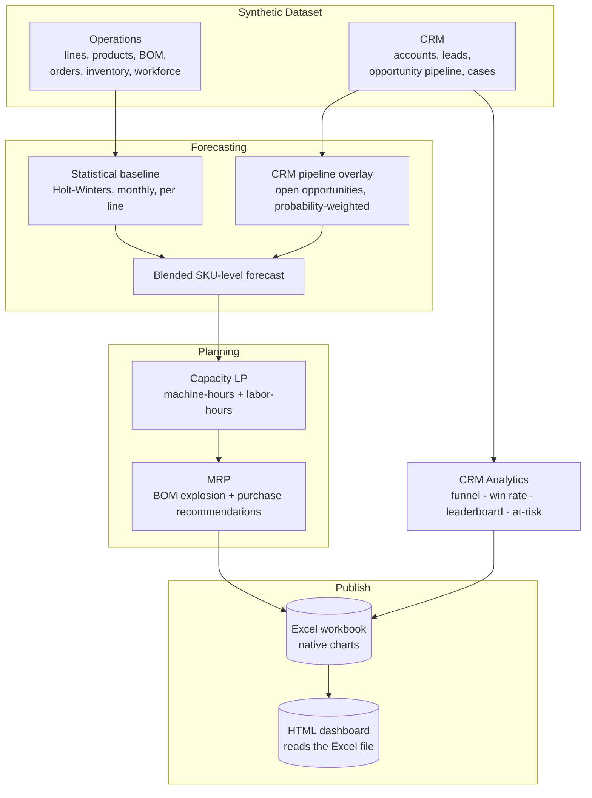
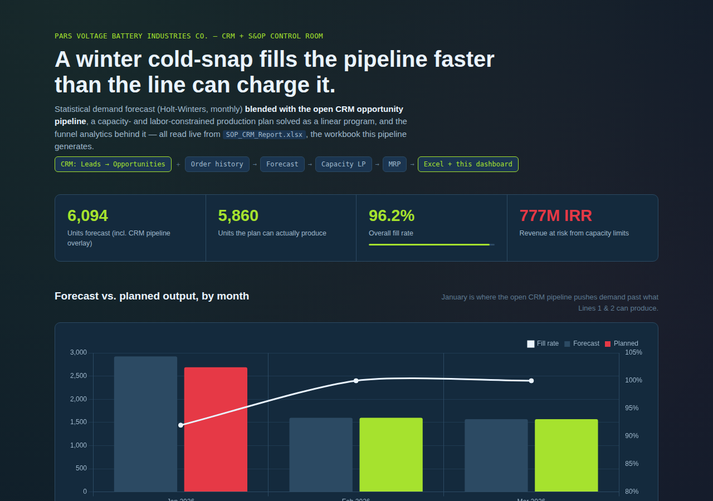

# Battery CRM + S&OP Planning Engine

[](https://github.com/Milad-Shabani/battery-crm-sop-planning-engine/actions/workflows/ci.yml)


A **CRM-integrated Sales & Operations Planning engine** for a fictional
four-line lead-acid battery manufacturer (~180 employees, ~70 B2B
accounts): a Dynamics-365-style CRM pipeline blended into demand
forecasting, a capacity- and labor-constrained production plan solved as a
linear program, a Material Requirements Plan, and CRM funnel analytics —
published to a formatted **Excel workbook with native charts** and a live
**HTML dashboard that reads straight from that workbook**.

Built as a portfolio implementation of the problem in
[`docs/PROBLEM_STATEMENT.md`](docs/PROBLEM_STATEMENT.md), on a fully
synthetic dataset generated by this repo (~35K rows across 18 tables —
see [`docs/DATA_DICTIONARY.md`](docs/DATA_DICTIONARY.md)).

## The flow



Full diagram with the quality gate and backtest loop: [`docs/ARCHITECTURE.md`](docs/ARCHITECTURE.md).

## Why this is more than "forecast + multiply"

| Concern | How it's handled |
|---|---|
| B2B demand is lumpy, not smooth | Forecasting at **line-level, monthly** grain (not per-SKU, weekly) — the coefficient of variation drops from ~0.6-1.0 to ~0.4-0.6, the difference between forecastable and not |
| The CRM knows things history doesn't | Every **open** opportunity's `quantity × probability` is added directly to the forecast for its expected close month — concrete, probability-weighted evidence, not folded silently into a statistical average |
| Being honest about forecast accuracy | Backtest WAPE is reported plainly (**~48%** — see below) — deliberately not hidden, because it's the actual motivation for building the CRM overlay in the first place |
| A line can't make everything the blended forecast wants | Solved as a genuine LP (`scipy.optimize.linprog`) per line/month: maximize revenue subject to **both** machine-hours and labor-hours (from real simulated attendance) |
| Which products get priority when capacity is tight | The LP's answer, not a heuristic — verified in `tests/test_planning.py` |
| Buying the right materials at the right time | MRP explosion through a real BOM (scales with battery capacity_ah), netted against on-hand inventory, purchase orders sized to supplier lead time + safety stock |
| CRM health beyond the forecast | Lead conversion by source, win rate by account segment, sales-cycle length (won vs. lost), lost-opportunity reasons, a rep leaderboard, and an explainable at-risk-account flag |
| A real business deliverable, not a database dump | A formatted, multi-sheet **Excel workbook** with native charts and conditional formatting — the artifact a CRM/ops team would actually open |

## What the output actually looks like

Running the engine on the bundled dataset (3-month forecast horizon,
landing on the winter cold-snap):



| month | fill rate | revenue at risk |
|---|---|---|
| **Jan 2026** (winter cold-snap) | **92.0%** | **~777M IRR** |
| Feb 2026 | 100% | — |
| Mar 2026 | 100% | — |

Only the **Automotive SLI** and **Motorcycle** lines — the two with
winter-driven seasonality — hit their capacity limit; Industrial/UPS and
Deep-Cycle/Solar aren't seasonal in the same way and clear their forecast
easily. The LP's response inside the constrained month: fully serve the
higher-priced SLI/motorcycle models first, and let the cheapest "Compact"
variants absorb the shortfall — exactly the revenue-maximizing call a
manual planner would want to make, made automatically.

Backtested statistical forecast accuracy: **48.2% overall WAPE** across the
4 lines (2-month rolling backtest) — genuinely moderate, and presented as
such: individual large B2B orders create variance no time-series model can
predict from history alone, which is precisely why the CRM pipeline
overlay above adds real value instead of being a nice-to-have.

## Excel workbook

`data/processed/SOP_CRM_Report.xlsx` — generated by `load/excel_export.py`
using `openpyxl` directly (not just `DataFrame.to_excel`), so it's a real
deliverable: styled headers, frozen panes, conditional formatting on
material shortages and at-risk accounts, and native embedded Excel charts
you can still click into and edit. Seven sheets: Executive Summary, Demand
Forecast, Production Plan, Material Requirements, CRM Pipeline & Funnel,
Sales Rep Leaderboard, At-Risk Accounts.

## Dashboard

The HTML dashboard (`dashboard/index.html`) is static and self-contained —
no server, works offline — and its data comes from **reading the Excel
workbook directly**, not a separate database:

```bash
python -m crm_sop_planning.cli run          # regenerates SOP_CRM_Report.xlsx
python scripts/export_dashboard_data.py     # reads it, writes dashboard/data.js
```

`export_dashboard_data.py` locates each table in the workbook by its
styled header row (the same fill color the writer uses), so the dashboard
reflects whatever is actually in the `.xlsx` file — the same one a CRM/ops
person would open. Enable **GitHub Pages** (Settings → Pages → Deploy from
a branch → `main` → folder `/dashboard`) for a live link.

## Quickstart

```bash
git clone https://github.com/Milad-Shabani/battery-crm-sop-planning-engine.git
cd battery-crm-sop-planning-engine
python -m venv .venv && source .venv/bin/activate
pip install -e ".[dev]" 2>/dev/null || { pip install -r requirements-dev.txt && pip install -e .; }

python -m crm_sop_planning.cli run
```

The bundled `data/raw/*.csv` already contains the full 2-year synthetic
dataset, so `run` works immediately:

```
Forecasted 3 months ahead: 6,094 units demanded (incl. CRM pipeline overlay),
5,860 units planned (96.2% fill rate) in ~1s (quality PASSED)
```

Inspect the results:

```bash
python -c "import sqlite3, pandas as pd; \
print(pd.read_sql('select * from fact_sop_monthly_summary', sqlite3.connect('data/processed/planning_warehouse.db')).to_string(index=False))"
```

Or just open `data/processed/SOP_CRM_Report.xlsx`.

### Regenerate the dataset (different seed or size)

```bash
python -m crm_sop_planning.cli generate-data --seed 7 --accounts 90 --leads 2200
```

### Docker

```bash
docker compose up --build planning
```

## Tests

```bash
pytest -v --cov=crm_sop_planning
```

25 tests covering the data generator (BOM scales with battery capacity,
open opportunities genuinely have no resolved outcome yet, production
respects line capacity), forecasting (zero-filling, backtest shape, the
pipeline overlay only counts *open* opportunities and adds on top of the
baseline), the capacity LP (prioritizes higher-revenue products, never
exceeds forecast or capacity), MRP (requirement explosion, order
recommendation + replenishment), CRM analytics (funnel conversion, win
rate excludes open deals, at-risk logic), and the quality gate.

## Data model

See [`docs/DATA_DICTIONARY.md`](docs/DATA_DICTIONARY.md) for full column
definitions across the operations dimensional model, the CRM entities, and
every pipeline output table/sheet.

## Possible next steps

- Point-in-time CRM snapshots (a real stage-change history per
  opportunity) to properly backtest the pipeline overlay's contribution,
  not just the statistical baseline.
- Multi-line product flexibility in the capacity LP.
- A proper labor-productivity model calibrated from the production log,
  replacing the fixed `operators_per_running_hour` assumption.

## License

MIT — see [LICENSE](LICENSE). All data in this repository is synthetic.
