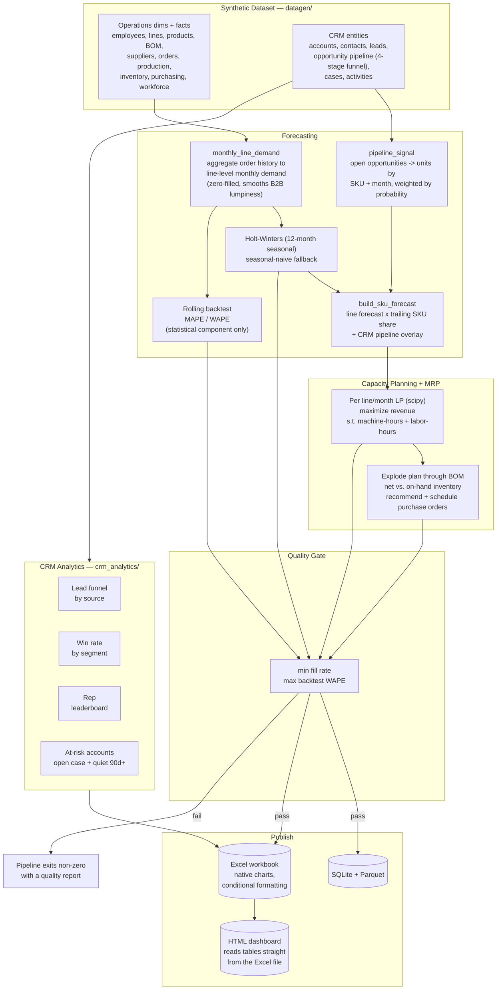

# Architecture

## Flow



## Why these choices

- **Line-level, monthly forecasting — not SKU-level, weekly.** B2B order
  data is lumpy at the SKU grain: most weeks have zero orders for any
  single battery model. Aggregating to the 4 production lines and to
  monthly buckets turns a coefficient of variation of ~0.6-1.0 (weekly,
  per-SKU) into ~0.4-0.6 (monthly, per-line) — forecastable, and also the
  natural grain a manufacturer actually plans capacity at.

- **The CRM pipeline is a forecast overlay, not a separate report.**
  `pipeline_signal.py` places every open opportunity's
  `estimated_quantity x probability` into the month bucket matching its
  expected close date, adds it on top of that SKU's trailing-share
  baseline, and that combined number is what the capacity LP actually
  plans against. The Excel/dashboard "Demand Forecast" sheet shows the
  baseline and pipeline contributions separately so the split stays
  visible instead of being silently folded together.

- **The backtest is honest about its scope.** Reproducing what the open
  pipeline looked like *as of* each historical cutoff would need
  point-in-time CRM snapshots (a full stage-change history) this dataset
  doesn't carry — opportunities are generated with their final or current
  state, not a change log. Backtesting only the statistical component,
  and saying so, is more defensible than a number that implicitly claims
  more than the data supports.

- **Two-constraint LP, same pattern as a pure-ops S&OP engine.** Machine-
  hours and labor-hours (from actual simulated attendance) both bound the
  plan; when a line can't meet full demand, the LP decides which products
  get made by maximizing revenue, not by serving orders first-come-first-
  served. Verified directly in `tests/test_planning.py`.

- **CRM analytics run alongside planning, not through it.** Lead funnel,
  win rate, sales-cycle length, and at-risk accounts are useful to a sales
  manager regardless of the production plan — they're computed
  independently and published to their own Excel sheets, not merged into
  the planning numbers.

- **The dashboard reads the Excel file, not a separate database.**
  `scripts/export_dashboard_data.py` locates each table in
  `SOP_CRM_Report.xlsx` by its styled header row (the same fill color
  `load/excel_export.py` writes) and extracts it with `openpyxl` — so the
  workbook a CRM/ops person actually opens is the single source of truth
  for what the dashboard shows, not a coincidentally-similar copy.

## Project layout

```
src/crm_sop_planning/
├── config.py, logging_config.py, io_utils.py, pipeline.py, cli.py
├── datagen/
│   ├── dimensions.py     # employees, lines, products, suppliers, materials, regions
│   ├── bom.py              # bill of materials (scales with capacity_ah)
│   ├── seasonality.py      # winter cold-snap + pre-Nowruz travel-prep demand curves
│   ├── crm.py               # accounts, contacts, leads, opportunity pipeline, cases, activities
│   ├── facts.py             # repeat + CRM-won orders, production, inventory, purchasing, workforce
│   └── build_dataset.py     # entry point: generates and writes data/raw/*.csv
├── forecasting/
│   ├── forecaster.py        # monthly line-level aggregation + Holt-Winters / seasonal-naive
│   ├── backtest.py           # rolling backtest + MAPE/WAPE (statistical component)
│   └── pipeline_signal.py    # open-opportunity overlay + SKU-level reconstruction
├── planning/
│   ├── capacity_lp.py         # per line/month revenue-maximizing LP
│   ├── mrp.py                  # BOM explosion + inventory netting + PO recommendations
│   └── sop_report.py           # consolidated monthly S&OP summary
├── crm_analytics/
│   └── funnel.py                # lead funnel, win rate, rep leaderboard, sales cycle, at-risk accounts
├── quality/
│   └── checks.py                 # fill-rate / backtest-WAPE quality gate
└── load/
    ├── outputs.py                 # SQLite warehouse + Parquet publish
    └── excel_export.py             # the formatted, chart-native Excel workbook
```
